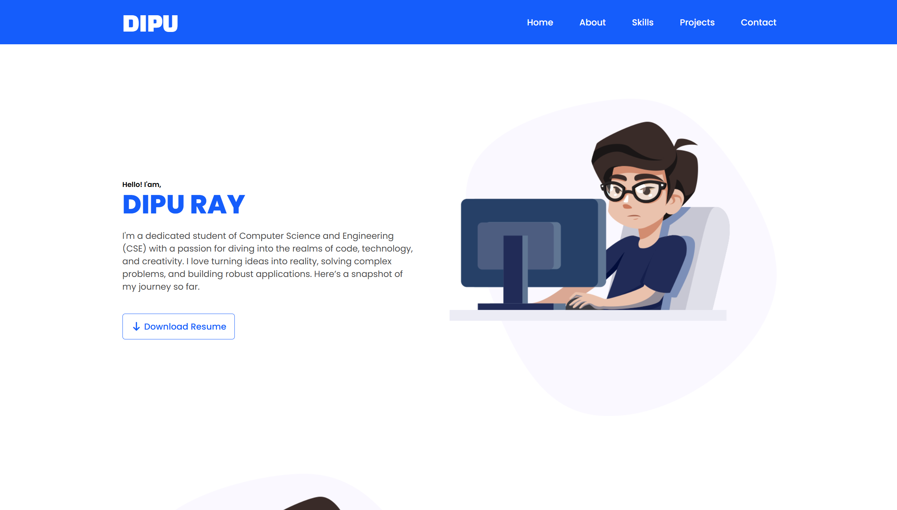
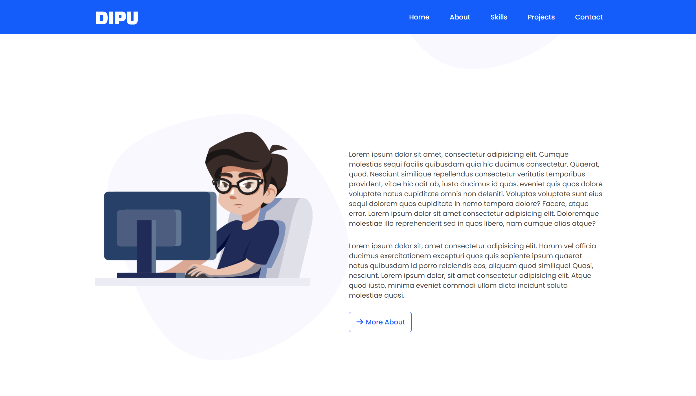
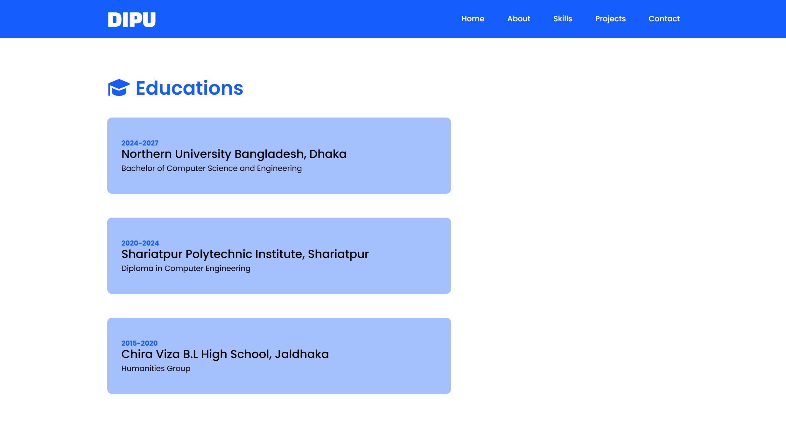

# 🌐 Personal Portfolio Website
📅 Date: March 16, 2026  
👨‍💻 Author: Dipu Ray  

---

## 📌 Project Overview
This is a personal portfolio website built using HTML and CSS.  
The purpose of this project is to develop my CSS coding skills better.

---

## ✨ Features
- All about yourself / myself.
- Education section
- Skills section
- Projects section
- Multiple cards

---

## 📂 Project Structure
```
personal-portfolio-website/
│── assets/
    └── icons/
    └── images/
    └── resume/
│── index.html
│── style.css

```

## 📸 Screenshot
<p align="center">
  
</p>
<p align="center">
  
</p>
<p align="center">
  
</p>

---

⭐ If you like this project, feel free to give it a star!