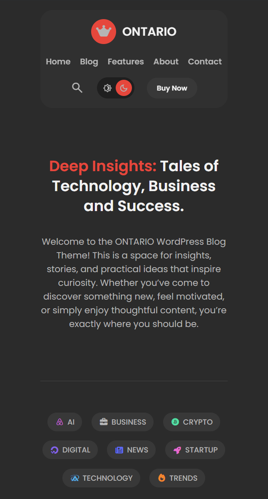
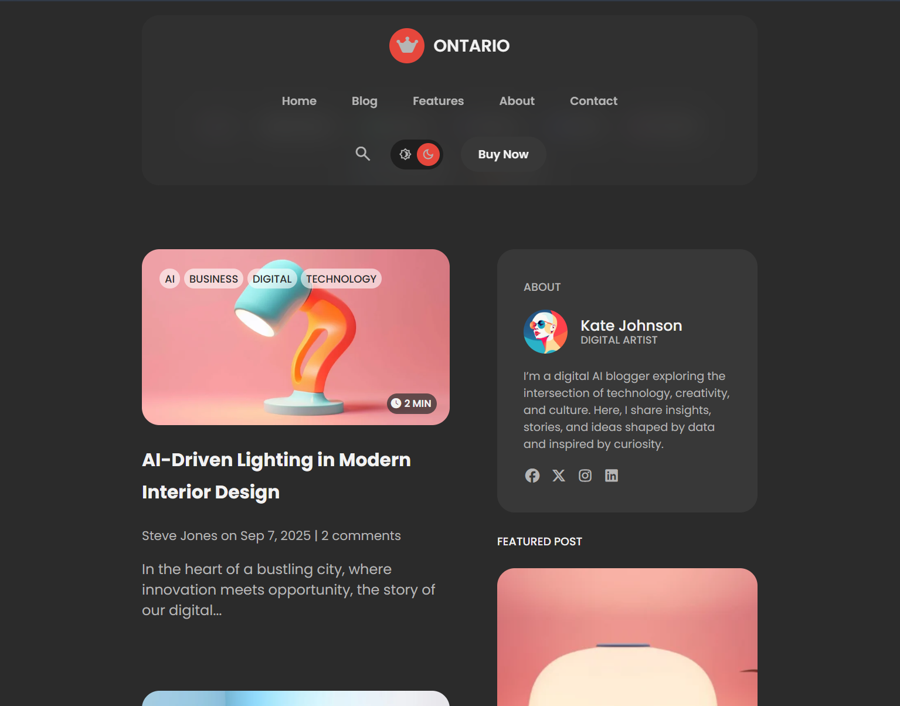
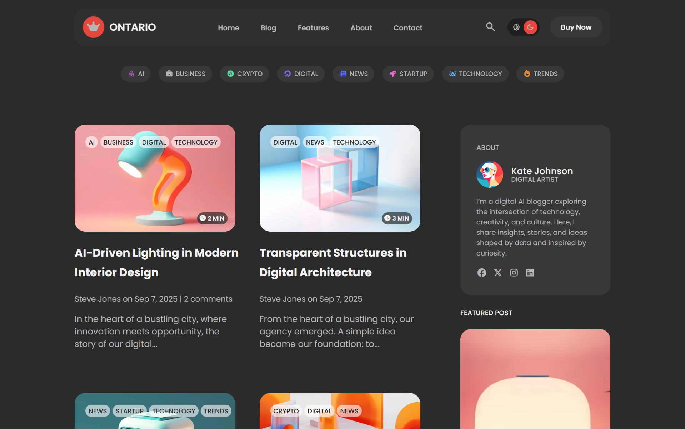

# 🌐 Simple Blog Page

📅 Date: March 22, 2026  
👨‍💻 Author: Dipu Ray

---

## 📌 Project Overview

This is a simple blog page built using HTML and CSS.  
The purpose of this project is to develop my CSS coding skills better.

---

## ✨ Features

- Categories & Tags
- Responsive & Clean Layout
- Thumbnail Images
- Author Profiles/Bio

---

## 📂 Project Structure

```
simple-blog-page/
│── assets/
    └── images/
│── index.html
│── style.css

```

## 📸 Screenshot

<p align="center">
  <h4>1. Phone Screen:</h4>
  
</p>
<p align="center">
  <h4>2. Tab Screen:</h4>
  
</p>
<p align="center">
  <h4>3. Laptop or Desktop Screen:</h4>
  
</p>

---

⭐ If you like this project, feel free to give it a star!
