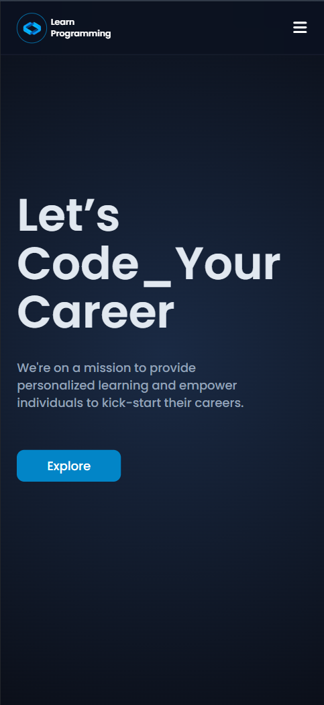
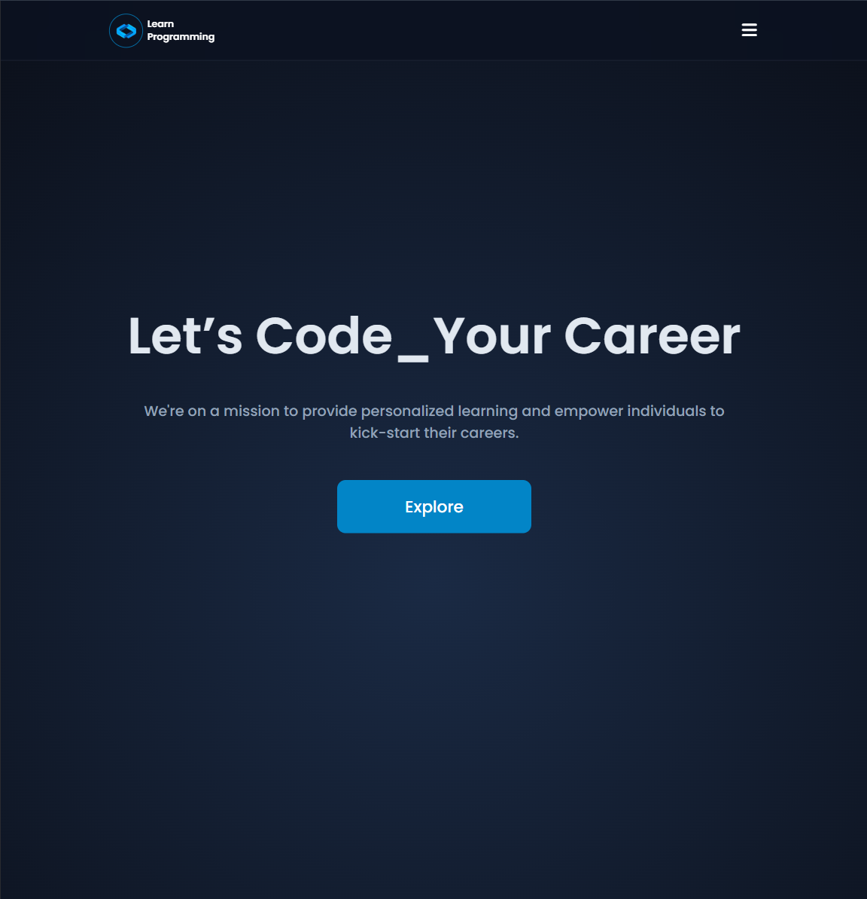
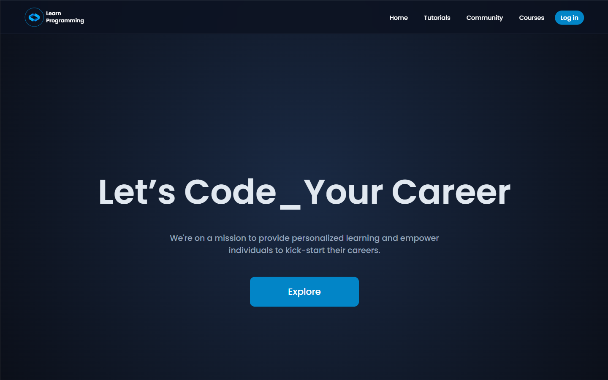

# 🌐 Online Learning Platform

📅 Date: April 16, 2026  
👨‍💻 Author: Dipu Ray

---

## 📌 Project Overview

This is a **Online Learning Platform** built using HTML and CSS.  
The purpose of this project is to develop my CSS coding skills better.

---

## ✨ Features

- Course Catalog
- Lesson Pages
- Embedded Multimedia
- Navigation Menus
- Forms
- Responsive Design

---

## 📂 Project Structure

```
├── online_learning_platform/
│   └── assets/
│   │    └── images/
│   │    └── svg/
│   └── index.html
│   └── style.css
```

## 📸 Screenshot

<p align="center">
  <h4>1. Phone Screen:</h4>
  
</p>
<p align="center">
  <h4>2. Tab Screen:</h4>
  
</p>
<p align="center">
  <h4>3. Laptop or Desktop Screen:</h4>
  
</p>

---

⭐ If you like this project, feel free to give it a star!
